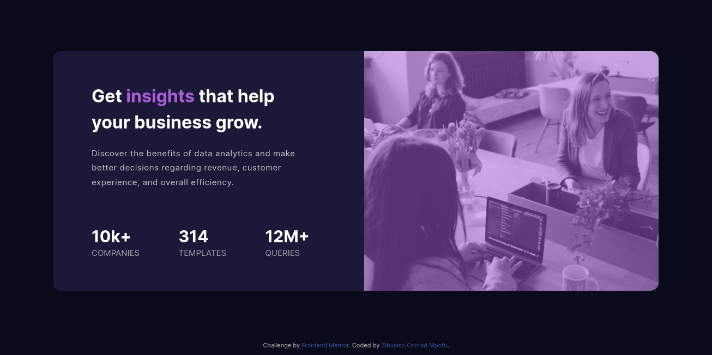

# Frontend Mentor - Stats preview card component solution

This is a solution to the [Stats preview card component challenge on Frontend Mentor](https://www.frontendmentor.io/challenges/stats-preview-card-component-8JqbgoU62). Frontend Mentor challenges help you improve your coding skills by building realistic projects. 

## Table of contents

- [Overview](#overview)
  - [The challenge](#the-challenge)
  - [Screenshot](#screenshot)
  - [Links](#links)
  - [Built with](#built-with)
  - [What I learned](#what-i-learned)
- [Author](#author)

## Overview

### The challenge

Users should be able to:

- View the optimal layout depending on their device's screen size

### Screenshot

### Links

- Solution URL: [Github link](https://github.com/ZibusisoConrad/fem-stats-preview-card)
- Live Site URL: [Vercel live site](https://fem-stats-preview-card-delta.vercel.app/)

### Built with

- Semantic HTML5 markup
- CSS custom properties
- Flexbox
- Mobile-first workflow

### What I learned

- Think and plan properlly before implementation

## Author

- Website - [Zibusiso Conrad Mpofu](https://github.com/ZibusisoConrad)
- Frontend Mentor - [@ZibusisoConrad](https://www.frontendmentor.io/profile/ZibusisoConrad)
- Twitter - [@notaCoderr](https://www.twitter.com/notaCoderr)
